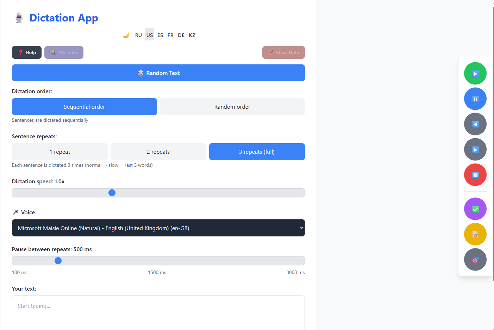
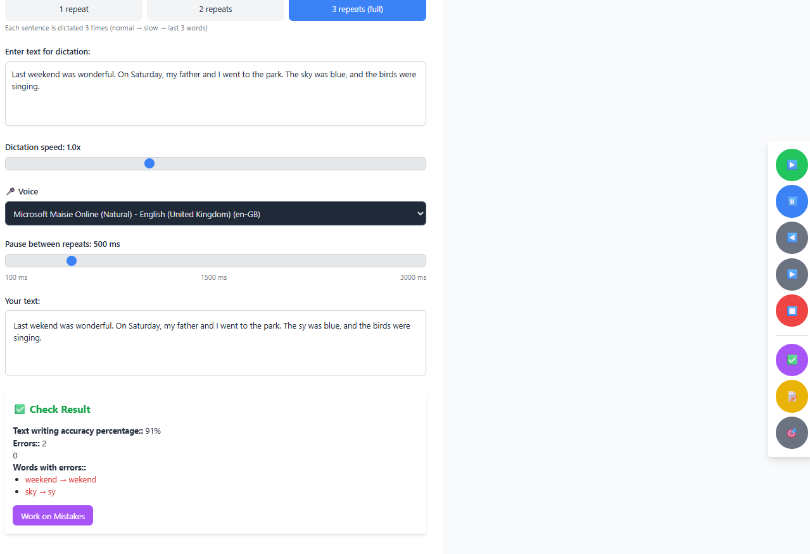

# 🎙️ speaktex — Dictation App

A modern dictation application that uses text-to-speech (TTS) to help you practice typing, improve spelling, and learn foreign languages through voice input.


## ✨ Features

- **🌍 Multilingual support** — Russian, English, Spanish, French, German, Kazakh
- **🎙️ Voice dictation** — Listen to sentences and practice typing them
- **🔁 Repeat modes** — Choose 1, 2, or 3 repetitions per sentence
- **📊 Accuracy check** — See your typing accuracy percentage and errors in real-time
- **🎯 Training mode** — Get real-time error highlighting as you type
- **🔀 Random order** — Dictate sentences in sequential or random order
- **⏱️ Typing speed** — Track your characters per minute (CPM)
- **🎲 Random texts** — Built-in texts for each language (easy, medium, hard)
- **📚 My Texts** — Save and load your own custom texts
- **🎤 Voice selection** — Choose from available TTS voices (male/female)
- **🌙 Dark theme** — Toggle between light and dark mode
- **⏳ Countdown** — 3-2-1 countdown before dictation starts
- **📱 Android support** — Built with Capacitor for native Android experience
- **💾 Auto-save** — Application state is preserved between sessions

## 📸 Screenshots

### Main Screen


### Check Results


## 📱 Download Android APK

A pre-built debug APK is available in the [`android/app/build/outputs/apk/debug/`](android/app/build/outputs/apk/debug/app-debug.apk) directory.

> **Note:** This is a debug build. For production, run `gradlew assembleRelease` and sign the APK.

## 💻 Desktop (Windows/Mac/Linux)

No installation required! The app runs in any modern browser (Chrome, Edge, Firefox).

1. Download `dist.zip` from the [Releases](https://github.com/KoksaSa/Speakertex/releases) page.
2. Extract the archive to any folder.
3. Open `index.html` file in your browser.

> **Tip:** You can also just open the `dist` folder in your file manager and double-click `index.html`.

## 🚀 Quick Start

### Prerequisites

- [Node.js](https://nodejs.org/) (v18 or later)
- [npm](https://www.npmjs.com/)

### Installation

```bash
# Clone the repository
git clone https://github.com/your-username/speaktex.git
cd speaktex

# Install dependencies
npm install

# Start the development server
npm run dev
```

Open your browser to **http://localhost:5173**

## 📱 Building for Android

```bash
# Install Capacitor dependencies
npm install

# Build the web app
npm run build

# Sync with Capacitor
npx cap sync android

# Open in Android Studio
npx cap open android
```

Or build APK directly:

```bash
cd android
gradlew assembleDebug
# APK will be at: android/app/build/outputs/apk/debug/app-debug.apk
```

## 🛠️ Available Scripts

| Script | Description |
|--------|-------------|
| `npm run dev` | Start development server |
| `npm run build` | Build for production |
| `npm run preview` | Preview production build |
| `npm run lint` | Run ESLint |
| `npm run typecheck` | Run TypeScript type checking |

## 📖 How to Use

1. **Select a language** — Click the flag icon (🇷🇺 🇺🇸 🇪🇸 🇫🇷 🇩🇪 🇰🇿)
2. **Load text** — Click "Random Text", "My Texts", or type your own
3. **Start dictation** — Click ▶️ Start (there will be a 3-2-1 countdown)
4. **Type** — Enter the dictated text in the input field
5. **Check** — Click ✅ Check to see your results

### Controls

| Button | Action |
|--------|--------|
| ▶️ | Start dictation |
| ⏸️ | Pause / Resume |
| ◀️ | Previous sentence |
| ▶️ | Next sentence |
| ⏹️ | Stop dictation |
| ✅ | Check your text |
| 📝 | Show/hide original text |
| 🎯 | Toggle training mode |
| 📚 | My Texts library |
| 🌙 | Toggle dark/light theme |
| 🎤 | Select TTS voice |

### Keyboard Shortcuts

| Key | Action |
|-----|--------|
| `Space` | Pause / Resume |
| `Esc` | Stop dictation |
| `Enter` | Check text |

## 🏗️ Tech Stack

- **React 18** — UI framework
- **TypeScript** — Type safety
- **Vite** — Build tool and dev server
- **Tailwind CSS** — Styling
- **Capacitor 8** — Native Android wrapper
- **Web Speech API** — Text-to-speech (browser)
- **Android TTS** — Text-to-speech (Android native)

## 📂 Project Structure

```
src/
├── App.tsx                      # Main component
├── main.tsx                     # Entry point
├── index.css                    # Global styles + dark theme
├── types/
│   └── global.d.ts              # Global type declarations
├── components/
│   ├── ControlPanel.tsx         # Playback controls
│   ├── DictationInput.tsx       # Text input field
│   ├── ResultDisplay.tsx        # Results display
│   ├── HelpPage.tsx             # Help modal
│   ├── CountdownOverlay.tsx     # Countdown overlay
│   └── MyTextsModal.tsx         # My texts library
├── hooks/
│   ├── useDictation.ts          # Dictation logic
│   └── useNativeTTS.ts          # TTS abstraction
└── utils/
    └── dictationTextsSimple.ts  # Built-in texts
```

## 🌐 Supported Languages

| Language | Code | Texts Available |
|----------|------|-----------------|
| 🇷🇺 Russian | ru-RU | ✅ |
| 🇺🇸 English | en-US | ✅ |
| 🇪🇸 Spanish | es-ES | ✅ |
| 🇫🇷 French | fr-FR | ✅ |
| 🇩🇪 German | de-DE | ✅ |
| 🇰🇿 Kazakh | kk-KZ | ✅ |

## ⚙️ Environment Variables

Copy `.env.example` to `.env` and configure:

```env
# Yandex.Metrika counter ID (optional)
VITE_YANDEX_METRIKA_ID=

# Yandex.RTB block ID (optional)
VITE_YANDEX_RTB_BLOCK_ID=
```

## 📄 License

Non-Commercial License — free for personal and educational use only. Commercial use is not permitted. See [LICENSE](LICENSE) for details.

## 🤝 Contributing

Contributions are welcome! Please feel free to submit a Pull Request.

1. Fork the repository
2. Create your feature branch (`git checkout -b feature/amazing-feature`)
3. Commit your changes (`git commit -m 'Add amazing feature'`)
4. Push to the branch (`git push origin feature/amazing-feature`)
5. Open a Pull Request

## 📞 Contact

For questions or suggestions, please open an issue on GitHub.
